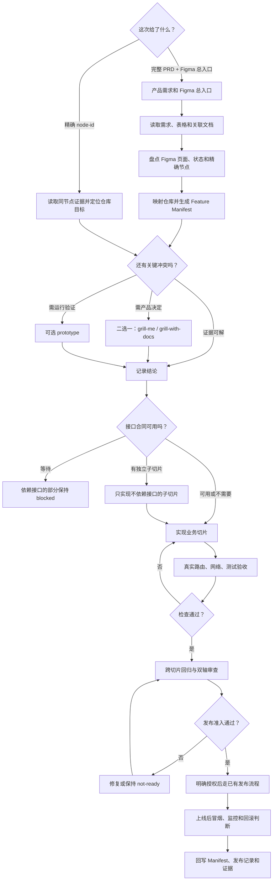

# FameEX Figma to Code

这是一套给 Codex 使用的开发流程。它帮助 Codex 把 Figma 设计还原到 FameEX 前端项目，并按项目现有方式完成开发和检查。

这份 README 面向使用者。Codex 的执行规则仍以 [`SKILL.md`](./SKILL.md) 为准；README 可以和 Skill 共存，但不会被 Codex 自动加载，因此不会增加日常任务的上下文消耗。

## 这套 Skill 解决什么问题

照着 Figma 写出一个页面并不难。真正容易出问题的是：页面写错地方、重复造组件、把设计里的示例当成真实业务，最后只看“页面能打开”就说已经完成。

- **找对页面**：先确认应该修改哪个应用、路由和文件，避免写错位置。
- **看懂设计**：同时查看 Figma 节点结构和截图，不凭一张图猜页面。
- **复用现有能力**：先找项目里已有的组件、接口和写法，避免重复开发。
- **不替业务做决定**：设计稿没有说明的接口、权限和状态，不自行编造。
- **用真实结果验收**：打开真实页面，检查交互、请求、测试和实际改动。

## 核心目的

这套 Skill 的目的，是让 Codex 不只是“把页面画出来”，而是把页面做对、接得上现有项目，也方便后续联调和维护。

简单来说，就是先把目标和依据弄清楚，再动手开发；遇到不确定的业务只停下相关部分，其他有依据的修改可以继续；完成后用真实结果验收，不靠感觉判断。

## 产品需求到代码闭环

第一次启动一个完整需求时，先提供完整需求和 Figma 总入口，再附上仓库和分支。Skill 会先读需求及其中的表格、链接，扫描 Figma 页面和状态，并生成一份 Feature Manifest；这一步只拆范围和冲突，不直接写代码。

之后按业务切片开发。一个切片可以包含一个路由的多个状态、弹窗、接口和验收项，不是“一张图写一次页面”。执行切片时直接从 Manifest 取得精确 `node-id`，不需要反复粘贴全部链接。单页小改则可以直接提供精确节点和目标路由。

两种入口可以同时使用：

- **精确节点直达**：只给带 `node-id` 的 Figma Design 链接，就按当前仓库定位页面或组件，不需要先创建 Feature Manifest；目标位置不唯一时才补充路由或文件。
- **完整需求模式**：给 PRD 和 Figma 总入口，先盘点页面、状态、接口和验收，再生成 Manifest 并按业务切片推进。

```text
完整需求 + Figma 总入口 -> 页面/状态清单 -> 业务切片
-> 精确节点 + 接口合同 -> 开发 -> 联调 -> 回归审查
-> 发布准入 -> 授权发布 -> 上线后验证
```

三个决策工具默认不加载，只在证据仍无法解决问题时使用：

- `grill-me`：没有现成领域文档，需要逐个确认产品选择。
- `grill-with-docs`：仓库已有 `CONTEXT.md` 或 ADR，需要核对术语和长期决策。两种访谈方式二选一。
- `prototype`：问题已经很具体，但需要用一个可运行的小实验验证。精确 Figma 已确定界面时，不再做 UI 原型；原型得出结论后必须删除或吸收。

### 需求到上线的完整闭环

联调完成不等于可以上线。切片完成开发和接口验证后，还要汇总做回归审查：一边检查是否符合仓库规范，一边检查是否真正满足需求、Figma、接口和验收项。

进入发布准入时，要锁定候选 commit，确认目标环境构建和 CI、相关人员签收、发布窗口、回滚方案和监控负责人。生产部署必须得到明确授权，并走仓库或团队已有流程；Skill 不会自己猜发布命令。

上线后再做安全冒烟、错误与指标观察，留下上线后验证证据。只有这一段也通过，整个需求才真正闭环。

## 适用场景

- 从带 `node-id` 的 Figma Design 链接实现新页面或组件。
- 重新审查已经完成的 Figma-to-Code 分支，校正视觉、交互和工程问题。
- 在 `fameex-web` 中判断 Input、Select、Button、Checkbox、Icon 和图片应该复用、适配、提升还是保留在页面内。
- 补齐前端文案的简体中文 i18n，并把其他语言交给翻译人员。
- 在接口或业务合同不完整时，避免伪造账号、资格、库存、提交成功或其他生产状态。

## Skill、插件、MCP 和应用清单

这套流程不是把能找到的工具全装一遍。日常只读精简的 [`references/capability-index.md`](./references/capability-index.md)；能力缺失或真正触发时，才读取完整的 [`references/capability-registry.md`](./references/capability-registry.md)。安装或配置完成后会回到原任务，而不是停在“工具装好了”。

### 必需能力

- **`figma`**：读取指定 Figma 节点的结构、截图、变量和原始素材。Skill 文件和 Figma MCP 是两件事，两者都要能用。
- **`figma-implement-design`**：把已经确认的设计放进现有项目，遵守路由、组件、多语言和业务边界。
- **`playwright`**：打开真实页面，检查布局、响应式、交互、跳转、请求、控制台和页面状态。
- **`superpowers:verification-before-completion` 或 `verification-before-completion`**：要求拿最新检查结果说话，没有证据就不能声称完成。

这些能力可能来自个人 Skill、系统 Skill 或已启用插件。名字来源不同没关系，只要能力完整、当前任务确实可调用，就不重复安装。

常用的官方插件提供者是：

- `figma@openai-curated`：提供 Figma 相关 Skill 和 MCP 集成。
- `superpowers@openai-curated`：提供完成前验证等开发流程 Skill。

插件只是能力来源，不是每次都要重新安装。先用 `codex plugin list` 看本机实际状态。

### 条件使用和可选能力

- **`skill-installer`**：只有必需或已经触发的 Skill 缺失，并且能确认准确安装来源时才使用。
- **`lark-doc` / `lark-sheets`**：需求入口是飞书 / Lark 文档时使用；会继续读取相关表格和链接，权限不足的部分单独标记。
- **`grill-me` / `grill-with-docs`**：只在现有证据无法解决关键选择时二选一，不作为每次开发的固定步骤。
- **`prototype`**：只验证一个已经收窄的问题，结束后不保留临时代码。
- **`tdd` 或 `superpowers:test-driven-development`**：新增或改变业务行为时二选一；纯视觉调整不加载。
- **`diagnosing-bugs`、`diagnose` 或 `superpowers:systematic-debugging`**：遇到难复现、间歇性或性能问题时三选一，先稳定暴露问题再定位。
- **`code-review` 或 `review`**：发布前或审查已有分支时二选一，分别检查仓库规范和需求实现。
- **`github:yeet`**：用户明确要求提交、推送或发布到 GitHub 时使用。
- **Figma Code Connect**：只在用户明确要建立或维护 Figma 组件与代码组件映射时使用，对应 `figma:figma-code-connect`。普通页面开发没有 Code Connect 也能继续。

Code Connect 通常还要求 Figma 组件已发布到团队组件库，并且账号套餐支持。读取已有映射可以帮助复用组件；新增映射会改动 Figma，必须得到用户明确授权。

### Figma MCP 实际使用的功能

正常页面开发会用到：

- `whoami`：确认当前使用的 Figma 身份，服务端支持时才调用。
- `get_design_context`：读取用户给出的精确节点结构，是开发前的必需证据。
- `get_screenshot`：读取同一节点截图，用来核对真实视觉。
- `get_metadata`：节点太大、上下文不完整或要继续定位子节点时使用。
- `get_variable_defs`：设计上下文没有带全颜色、间距等变量时使用。
- MCP 返回的素材地址：直接使用 Figma 原图和图标，不重新画一个相似版本。
- `get_code_connect_map`：有现成 Code Connect 映射时读取，帮助找到代码里的对应组件。

只有 Code Connect 任务才会用到：

- `get_code_connect_suggestions`：找出可能需要映射的组件。
- `get_context_for_code_connect`：读取生成 `.figma.ts` 映射需要的组件和代码上下文。
- `add_code_connect_map`：把映射写回 Figma；这是外部写操作，只能在用户明确要求后执行。

默认页面开发不会调用 `get_figjam`、`create_design_system_rules`、`get_strategy_for_mapping` 或 `send_get_strategy_response`。它们分别属于 FigJam、设计系统规则或特定 Code Connect 工作流，不应该因为工具存在就顺手执行。

### 实际开发会用到的技巧

- **同节点双证据**：结构和截图必须来自同一个 `node-id`，避免看着 A 节点却实现 B 节点。
- **四级复用判断**：把组件和素材分成 `reuse`、`adapt`、`promote`、`local`，先复用，再决定是否局部实现。
- **业务合同清单**：接口、权限、枚举、提交结果和后端状态必须能在 PRD、接口或代码里找到依据。
- **分块推进**：只暂停证据不足的部分，已经确认的布局、组件或非视觉修复可以继续。
- **真实路由验收**：不只看静态截图，还要检查语言、视口、交互、请求、控制台和账号状态。
- **最新证据交付**：测试、格式检查、类型检查和页面验证都以本次实际输出为准。

### 缺失时怎么补齐并继续

处理顺序很固定：先查当前 Skill 清单和个人目录，再查已启用插件；确认真的缺失后，才用 `skill-installer`、官方插件或仓库自带的兜底脚本。不能因为看到了另一个同名目录就重复安装。

官方插件缺失时：

```bash
codex plugin list
codex plugin add figma@openai-curated
codex plugin add superpowers@openai-curated
```

核心 Skill 仍缺失时，可按依赖说明运行兜底脚本：

```bash
/usr/bin/python3 <skill-root>/scripts/bootstrap_dependencies.py \
  --dependency <fallback-name> \
  --json
```

飞书文档能力缺失时：

```bash
npx skills add larksuite/cli -g -y
lark-cli --help
```

Figma MCP 没配置时：

```bash
codex mcp add figmaremotemcp --url https://mcp.figma.com/mcp
codex mcp login figmaremotemcp
codex mcp list
```

装好 Skill 后会直接读取新安装的 `SKILL.md` 并继续当前任务。插件或 MCP 新增后，如果当前任务仍看不到新工具，就重启 Codex 或新建任务，重新加载父 Skill，再从刚才卡住的步骤继续。OAuth 等需要本人确认的授权不会静默代办。

### 默认不会使用

- 不用 `browser`、`chrome` 或 `computer-use` 代替 Figma 节点证据和 Playwright 验收。
- 不用 `imagegen` 重做 Figma 已经提供的图片和图标。
- 不用网页搜索替代用户给出的 Figma、PRD、接口合同和仓库代码。
- 不会为了“以后可能用到”安装无关 Skill、插件或应用。

正常 Figma-to-Code 流程**没有必须安装的 App 或 Connector**。只有用户给出的资料或明确动作依赖某个外部应用时，才单独启用对应能力。

## 准备与安装

使用前需要：

- 可运行 Codex，并能发现本地 Skill。
- 能访问目标 FameEX Git worktree。
- 对目标 Figma 文件具有读取权限。
- 本机有 Python 3 和 `npx`。
- 运行时可用 `figma`、`figma-implement-design`、`playwright` 和 `verification-before-completion`；缺失时 Skill 会按安全顺序检查或补齐兜底依赖。

首次安装到 Codex：

```bash
git clone ssh://git@github.com/woyaofei303/fameex-figma-to-code.git \
  "${CODEX_HOME:-$HOME/.codex}/skills/fameex-figma-to-code"
```

如果目标目录已经存在，不要覆盖。先检查来源、分支和本地改动，再决定更新方式。

当前维护环境区分两个路径：

```text
源码仓库：/Users/julian/fameex-figma-to-code
运行时 Skill：/Users/julian/.codex/skills/fameex-figma-to-code
```

在当前机器上先修改源码仓库，验证并提交后，再按需同步运行时文件。通过整仓 clone 安装时 README 会一起存在，但 Agent 只会按触发规则加载 `SKILL.md`。

## 快速使用

启动完整需求：

```text
使用 $fameex-figma-to-code 先梳理这个需求，不要直接写代码：
产品文档：<Lark PRD 链接>
Figma 总入口：<Figma 文件或页面链接>
仓库/分支：<目标仓库和分支>
```

精确节点直达（原来的用法）：

```text
使用 $fameex-figma-to-code 实现这个界面：
<带 node-id 的 Figma Design 链接>
```

开发一个业务切片：

```text
使用 $fameex-figma-to-code 实现 Feature Manifest 中的切片：<slice-id>
Manifest：<文件路径>
```

检查是否可以上线：

```text
使用 $fameex-figma-to-code 检查这个功能的 release-readiness：
Feature Manifest：<文件路径>
候选 commit：<commit SHA>
目标环境：<仓库已有环境>
```

审查已有实现：

```text
使用 $fameex-figma-to-code 审查当前分支已有的 Figma-to-Code 实现：
<带 node-id 的 Figma Design 链接>

目标路由：<可选>
目标文件：<可选>
```

示例：

```text
使用 $fameex-figma-to-code 实现这个界面：
https://www.figma.com/design/...?...&node-id=12645-358
```

## 完整执行流程

下面 12 步是完整需求模式。精确节点直达会跳过需求总盘点和 Manifest 初始化，从同节点证据、仓库定位、合同确认开始，后面的开发与验收规则保持一致。

1. **读产品**：读取主需求、内嵌表格、关联文档和相关本地历史。
2. **盘设计**：用 Figma 总入口找全页面和状态，再记录每个切片的精确节点。
3. **看项目**：确认应用、路由、组件、接口、多语言和测试写法。
4. **建清单**：逐条连接需求、设计状态、接口、代码、埋点、验收和证据。
5. **拆切片**：按能独立验收的业务能力拆，不按截图数量拆。
6. **解冲突**：产品管业务，Figma 管视觉，接口管数据；仍无法确定时才选用访谈或原型。
7. **做开发**：每次实现一个切片；新增业务行为先记录测试边界并用一套 TDD 能力推进，纯视觉修改直接进入实现和页面验证。
8. **做联调**：接口未提供就保持等待，只实现不依赖接口的子切片。
9. **做回归**：跨切片检查 Web、Admin、账号状态、语言、视口、接口和相邻流程。
10. **做审查**：分别检查仓库规范和产品需求，处理发现的问题。
11. **过发布门**：锁定 commit，检查构建、CI、签收、发布计划、回滚方案和监控。
12. **上线后验证**：经明确授权发布后做安全冒烟和观察，决定保留、继续观察或回滚。



遇到问题时，处理方式也很简单：

- 工具缺失时，先补安装或配置，然后回到原任务。精确节点仍读不到，视觉部分先停。
- 接口或业务不清楚时，依赖部分保持阻塞，只实现能独立验收的子切片。
- 检查没有通过时，先判断是普通偏差还是难复现、间歇性或性能问题；后者只选一套诊断能力建立稳定反馈，再修复和复验。
- 发布准入未通过时保持 `not-ready`；没有明确授权时最多只能说“准备就绪”，不能执行生产发布。

## FameEX 工程规则

### 组件优先复用

按以下顺序查找：

1. 当前应用的组件系统，例如 `@fameex/ui`。
2. 当前应用的共享组件、Hook 和状态实现。
3. 相邻业务页面的已有模式。
4. 页面内实现。

每个控件或资源归到一种处理方式：

- `reuse`：现有能力直接满足需求。
- `adapt`：复用现有能力，通过公开属性、组合或局部样式适配。
- `promote`：语义稳定并有跨页面复用价值，提升到共享包。
- `local`：业务或页面属性明显，保留在当前功能内。

### Icon 和图片

- 先检查 `packages/icon/output/icon-list.json` 和 `packages/icon/svg-files/**`。
- 已有合适 Icon 时直接复用。
- 找不到合适 Icon 时先使用 Figma 原始资源，不手画近似 SVG，也不引入第三方 Icon 包。
- 通用且可能跨页面复用的 Icon 可以提升到 `packages/icon`。
- Banner、插画、装饰图和强业务素材通常保留在页面资源目录。

### 多语言

- 页面可见文案、提示、校验、状态、无障碍标签和 Metadata 都进入 i18n。
- Customer Web 的页面级 Meta 文案统一放在 `tdk`，页面正文继续使用所属业务 namespace；后端返回的动态 SEO 不复制到 `tdk`。
- 如果新的 `tdk` 路由 key 只补简体中文，还要把该 key 加入 `ZH_CN_SOURCE_ONLY_TDK_KEYS`，补 loader 测试，并实际打开一个非中文路由确认不会显示 raw key。
- 默认只新增或修改简体中文 `zh-CN` / `zh_CN`。
- 不自动生成英文、机器翻译、其他语言占位文件或复制中文。
- 其他语言由翻译人员维护。

### 业务边界

Figma 用于确认视觉和交互意图，不作为接口或权限合同。

没有真实接口、PRD 或仓库合同支持时，不实现或伪造：

- 提交和变更结果。
- 用户等级、UID、资产或余额。
- 资格、库存、审核和发货状态。
- 权限、枚举和跳转目标。

涉及地址、账号、证明材料等敏感信息时，如果提交合同尚未确认，先停止提交能力并报告缺失合同。继续完成视觉页面时，只能依据设计证据、仓库约定或用户确认选择隐藏或禁用输入和 CTA；不得留下只能失败或伪造成功的操作。

### 接口联调

只有页面包含真实查询、变更、上传或后端状态时，Skill 才加载 [`references/api-integration.md`](./references/api-integration.md)。它要求先记录消费应用、接口来源、方法和路径、鉴权范围、请求/响应字段、边界转换、Query Key、启用条件、变更后刷新方式及验证证据。

Admin 聚焦测试必须在 `@fameex/admin` 包上下文运行，避免根目录 Vitest 把 `@` 解析到 Web；Web 测试继续使用根目录配置。跨应用接口在复用前必须用消费应用的真实登录态验证鉴权、代理前缀和响应语义。

## 内置检查脚本

### 组件和资源复用候选

```bash
SKILL_DIR="/Users/julian/fameex-figma-to-code"

/usr/bin/python3 "$SKILL_DIR/scripts/audit_reuse.py" \
  --repo-root /Users/julian/fameex-web \
  --limit 40 \
  /Users/julian/fameex-web/apps/web/src/apps/VipGift
```

脚本只负责列出候选，最终仍需结合语义判断 `reuse`、`adapt`、`promote` 或 `local`。

### i18n 引用完整性

```bash
SKILL_DIR="/Users/julian/fameex-figma-to-code"

/usr/bin/python3 "$SKILL_DIR/scripts/audit_i18n_lookups.py" \
  --namespace-json /absolute/path/to/zh-CN/namespace.json \
  --source /absolute/path/to/page.tsx \
  --source /absolute/path/to/feature-directory \
  --key explicit.dynamic.key \
  --json
```

脚本会按 `useT` / `getT` 的静态作用域区分 namespace，也识别 `{ t: tVip }` 这类静态别名。动态或模板 key 不会被猜测，需要用可重复的 `--key` 参数显式补充。检查 `tdk` 这类共享 namespace 的单个页面时增加 `--allow-unused`；其他页面的未使用 key 会保留在报告中，但不会让本次检查失败。

### 缺失依赖补齐

```bash
SKILL_DIR="/Users/julian/fameex-figma-to-code"
/usr/bin/python3 "$SKILL_DIR/scripts/bootstrap_dependencies.py" \
  --dependency <fallback-name> \
  --json
```

脚本不会覆盖已存在的 Skill 目录。只有四项能力全部缺失时才省略 `--dependency`。详细规则见 [`references/dependency-bootstrap.md`](./references/dependency-bootstrap.md)。

### Figma MCP 首次配置

`figma` Skill 已安装，不代表当前 Codex 已经能读取 Figma。Skill 会先检查当前任务的工具和已有 MCP 配置；如果已经存在一个指向官方地址、完成 OAuth 且可调用的配置，就直接复用，不会因为另一个同地址配置显示 `Not logged in` 而重复登录。

本机还没有 Figma MCP 时，推荐执行：

```bash
codex mcp add figmaremotemcp --url https://mcp.figma.com/mcp
codex mcp login figmaremotemcp
codex mcp list
```

OAuth 授权需要用户确认，Codex 可以发起登录并打开授权流程，但不能替用户静默确认。登录后还会在当前任务里实际调用身份读取、目标节点结构和同节点截图；只有这些工具都能调用，才继续开发页面。

如果登录成功后当前任务仍看不到 Figma 工具，需要重启 Codex 或新建任务，再重新加载 Skill。不能只凭登录成功、网页截图或已有代码猜测设计。

## PR-01982 实际案例

这个 Skill 已用于重新审查 FameEX Web 的 VIP 页面，包括：

```text
/zh-CN/VIP
/zh-CN/VIP/gift
/zh-CN/VIP/manager
```

礼包页审计前视觉已经接近设计，但存在以下问题：

- 无用户数据时默认显示 VIP3。
- 达到 VIP3 被直接解释为已获得礼包资格。
- 没有真实提交接口时仍收集姓名、电话、地址和 Telegram。
- 前端本地状态模拟提交成功。

审计后：

- 访客显示 VIP0。
- VIP3 只表示达到等级门槛，资格和发放仍待确认。
- 五个敏感信息输入和 CTA 从可交互改为禁用。
- Input 继续复用 `@fameex/ui`，原生 CTA 改为共享 `Button`。
- 新文案只补充简体中文。
- 聚焦测试负责锁住游客状态、资格边界、禁用提交和多语言路径。验证数字以命令的当前输出为准，不在案例里长期写死。

后续联调还暴露出一个容易被忽略的边界：页面改完、接口接通、聚焦测试通过，只能说明对应开发切片和联调切片有证据，不能直接等同于“可以上线”。PR-01982 的历史经验已经沉淀进 Skill：Admin 配置影响 Web 展示时先联调 Admin；Admin 和 Web 在各自包上下文验证；仓库已有的类型错误与本次新增问题分开记录。

准备上线前再进入 `release-readiness`：固定候选提交，补齐跨页面回归、双维度审查、目标环境构建或 CI、各方确认、发布窗口、回滚和监控。得到明确授权并通过项目现有发布流程后，才进入 `post-release-validation` 做生产安全冒烟、监控和保留/观察/回滚判断。

Figma 案例：

[「FameEX 三期」WEB - VIP 实物礼包](https://www.figma.com/design/KzvWxAYxqfgpoiYuKdxMAE/%E3%80%8CFameEX%E4%B8%89%E6%9C%9F%E3%80%8D----WEB?node-id=12645-358&m=dev)

分享文档：

[FameEX Figma-to-Code Skill 分享](https://qfglxo2m3dc.sg.larksuite.com/docx/JeEPdRRmEoQecexKjKbl3lsDg4e)

## 验证 Skill

先运行脚本单元测试：

```bash
cd /Users/julian/fameex-figma-to-code
/usr/bin/python3 -m unittest discover -s scripts -p 'test_*.py'
```

当前测试覆盖：

下面包含脚本行为测试和 Skill 静态合同检查；静态合同检查用于防止关键规则被删，不能代替真实 MCP、仓库和浏览器验证。

- 复用候选扫描。
- i18n 静态引用扫描。
- Customer Web `tdk` Metadata 归属和 namespace 前缀扫描。
- 依赖补齐和不覆盖保护。
- Skill、插件、MCP、应用分类和“补齐后继续原任务”的静态合同检查。
- Figma MCP 注册、OAuth、重复配置选择和运行时刷新边界的静态合同检查。
- 可选接口联调引用、契约字段、分应用测试命令和网络证据要求。
- 产品需求、设计节点、接口、代码、验收证据的逐条追踪合同检查。
- 精确节点直达与完整需求模式互不覆盖的兼容合同检查。
- 跨切片回归、双维度审查、发布准备、回滚和上线后验证的静态合同检查。

再检查运行环境：

```bash
test -f /Users/julian/.codex/skills/fameex-figma-to-code/SKILL.md
command -v npx
```

最后在一个新的 Codex 任务中使用“快速使用”的提示词和一个已知 `node-id`。端到端 smoke test 应确认：Skill 被触发、Figma 节点可读取、真实路由可定位，并能启动浏览器验证。脚本单测通过不能代替这四项检查。

## 仓库结构

```text
SKILL.md                 Agent 执行入口
README.md                人类使用说明，不作为 Agent 执行入口
agents/openai.yaml       Skill 列表和默认提示词元数据
references/              FameEX 规则、已有实现审计与验收合同
assets/templates/        需求追踪和发布准备的可复用模板
scripts/                 复用、i18n 和依赖检查脚本及测试
assets/fallback-skills/  缺失依赖的安全兜底
```

## 进一步阅读

- [`SKILL.md`](./SKILL.md)：完整执行流程。
- [`references/capability-index.md`](./references/capability-index.md)：默认加载的精简能力索引。
- [`references/capability-registry.md`](./references/capability-registry.md)：需要安装、配置或判断边界时再读的完整能力清单。
- [`references/dependency-bootstrap.md`](./references/dependency-bootstrap.md)：缺失依赖的安装、配置和原任务恢复流程。
- [`references/fameex-web.md`](./references/fameex-web.md)：FameEX Web 组件、Icon、多语言和验证规则。
- [`references/api-integration.md`](./references/api-integration.md)：真实查询、变更、上传和后端状态的接口联调规则。
- [`references/product-delivery-workflow.md`](./references/product-delivery-workflow.md)：从完整需求和 Figma 总入口拆到业务切片、接口与验收的流程。
- [`references/exact-node-workflow.md`](./references/exact-node-workflow.md)：只提供精确 Figma 节点时的轻量单页流程。
- [`references/existing-implementation-audit.md`](./references/existing-implementation-audit.md)：已有分支的审计流程。
- [`references/release-readiness.md`](./references/release-readiness.md)：从联调完成到发布准备、上线验证和回滚的流程。
- [`references/verification-contract.md`](./references/verification-contract.md)：浏览器证据与最终交付合同。
